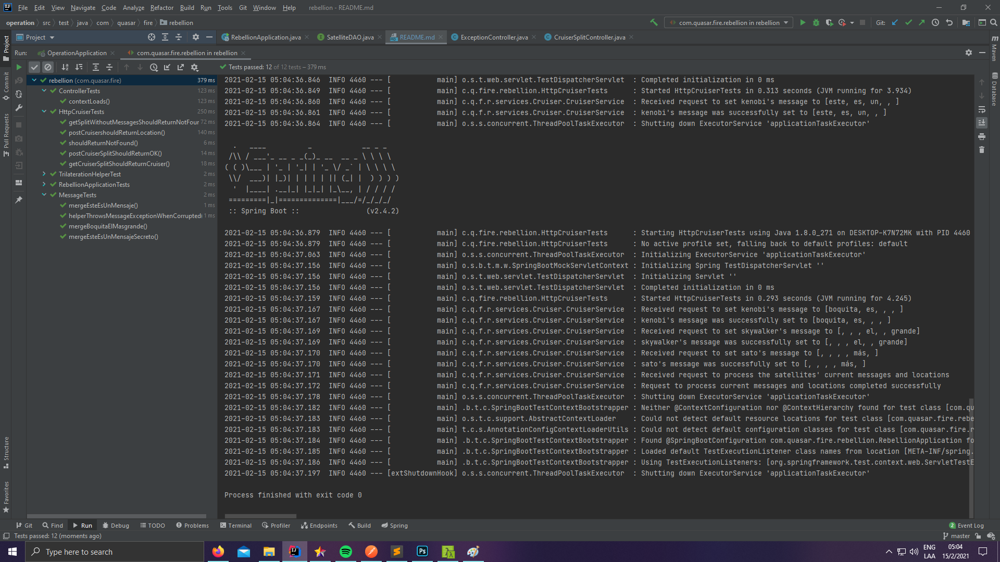

# Operation Quasar Fire
A Mercadolibre Exercise involving Trilateration

Live demo: https://stormy-bayou-71921.herokuapp.com/

Postman Documentation: https://documenter.getpostman.com/view/10250820/TWDTKyPi

Relevant documentation and the postman collection can be found on /docs/

## How to run the application
### In Intellij
- Open Intellij IDEA
- Go to File -> Open
- Navigate to your project's root folder and select it
- Make sure you have Java 8 installed (higher will work but won't publish to heroku)
- Run the program from com.quasar.fire.rebellion.RebellionApplication

### Testing with Intellij
- You will find tests under the ./test folder.
- By right-clicking on the folder and pressing "Run All Tests", the results should appear in the Debug View

### Deploying to heroku
- Make sure to have Heroku CLI installed and permissions to the remote server
- Navigate to your project's root folder using Cmder or equivalent
- Type:
        
        git push heroku master

### Making JAR Executable
- Using Cmder or equivalent, navigate to your project's root folder
- Having Maven installed, run the following:

    mvnw clean package
    mvnw spring-boot:run
- The jar will now be located at ./target as **operation-0.0.1-SNAPSHOT.jar**
- Tip: "clean package" will also run the project's tests, as shown below

## Important Domain Decisions: 

- Even though multilateration allows for N points, I opted to use only three for simplicity's sake since it would involve more complex equations
- The method used has an error margin, the tests ignore up to 0.001 delta.
- Satellites' names are assumed to be unique since there is no ID in the requests
- Messages' offset are assumed to only occur at the beginning and not at the end, although they can be different lengths between each other
- If, after accounting for the offset, none of the messages has the segment, said segment cannot be recovered and an exception will be thrown
- TrilaterationHelper has non-expressive private methods. This is because they are used for calculations that don't have an object-oriented meaning, and is deliberate so as to make the overall equation easy to understand.

### Explanation for Helpers

####Trilateration
Below you'll find a mathematical explanation for the equations used in TrilaterationHelper:

We can interpret the three points and distances as three circles with radii, that may or may not intersect in a single point.
[You can visualize this in the desmos example I made.](https://www.desmos.com/calculator/2hjb09hrij)

Therefore, the problem becomes a set of three equations (the circles) with two variables (the point in common)
xi,yi being the location of the satellite, ri being the distance to the cruiser. X,Y being the location of the cruiser.

1) (x-x1)² + (y-y1)² = r1²

2) (x-x2)² + (y-y2)² = r2²

3) (x-x3)² + (y-y3)² = r3²

By expanding the formulas and doing 1-2 , and 2-3, we're left with:

4) (-2x1 + 2x2)x + (-2y1 + 2y2)y = r1² - r2² - x1² + x2² - y1² + y2²
5) (-2x2 + 2x3)x + (-2y2 + 2y3)y = r2² - r3² - x2² + x3² - y2² + y3²

This resolves to a linear set of equations of the type:

6) Ax + By = C
7) Dx + Ey = F

By solving it we're left with:

8) x = (CE−FB) / (EA−BD)
9) y = (CD−AF) / (BD−AE)

Which are the equations that we see inside getPosX and getPosY.
In turn, although we gain a straight forward calculation, we lose expressiveness in the Helper and that is the reason they're marked as private.

####Message
Since offsets only occur at the beginning, we can assume that the length of the actual message is (at most) the length of the smaller satellite message.
The following message's length is 4 segments

['', 'este', 'es', 'un', 'mensaje']

['este', '', “un', 'mensaje']

['','','', '', 'es', '', 'mensaje']

Thus we can assume that index N-4 is the beginning of the message, N being the incomplete message's length

Once they're synced, we can reduce the lists, 'merging' each segment with the other one if it's empty.
This results in the actual message being returned.

If any empty segment is left, an exception is thrown.